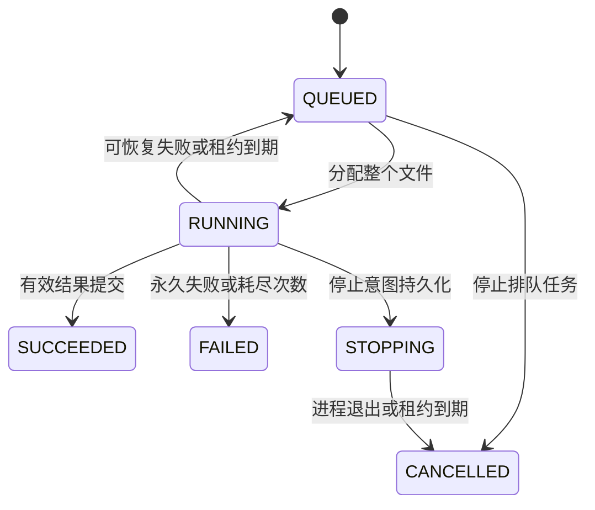

# 架构与可靠性契约

一个文件一个Task，Task包含完整本地DAG。一个Attempt始终绑定同一个执行器会话。
执行器可同时运行多个Task，每个任务独立子进程，内部使用无GIL线程池。
管控API负责持久化和命令，后台线程恢复到期任务，执行器主动领取。
PostgreSQL是生产状态依据，SQLite仅支持单机开发。所有Pod在相同路径挂载RWX文件系统。

## 状态

Attempt为追加记录，终态为SUCCEEDED、FAILED、CANCELLED或LOST。
自动重试追加Attempt并从第一步骤开始；手动重试创建新Task，幂等键包含原Task ID。

## 事务与租约

- 修改在数据库事务中进行，状态与事件一起提交。
- PostgreSQL写入使用事务级advisory lock；SQLite使用BEGIN IMMEDIATE。
  该版本优先单管控正确性，不在网络或业务执行期间持有事务。
- 领取持久化任务、Attempt、随机令牌和请求ID；成功领取重放返回同一分配。
- 数据库时间决定租约，续租不超过任务deadline。
- 执行器用请求开始的单调时间计算保守有效期；管控不可用时也停止过期任务。
- 续租、进度和提交必须匹配当前Attempt、会话、令牌、状态和有效期。
- 完成响应丢失可重放同一请求；不同结果的重放被拒绝。
- 取消与完成由事务排序，取消先提交则结果不能变成成功。

网络分区可能导致新旧Attempt短暂同时计算，但只有有效结果被接受。
外部副作用必须使用稳定任务/记录标识做幂等，不保证任意业务只执行一次。

## 输入与输出

管控提交时流式计算SHA256，任务开始和结束核对输入未变化。输入必须位于data-root
且在任务生命周期内保留。输出写 outputs/<task-id>/<attempt-id>/ 独立目录，
Task.result的已提交manifest引用是正式结果。消费者不能通过扫描输出目录判断成功。
失败输出保留供诊断，清理不得删除成功引用，自动GC尚未实现。

## 停止与恢复

Pod/节点故障由租约感知，无需K8S API权限。指数退避与max_attempts控制重试。
管控重启核对持久化Attempt，有效执行继续、过期执行重排。数据库不可用期间暂停
分配和提交，恢复后核对，不能根据内存推断成功。
停止先持久化STOPPING，再SIGTERM协作退出，超过stop_grace发送SIGKILL到任务进程组。
确认子进程退出并清理同组剩余进程后才释放槽位。Linux父进程死亡信号保护直接
任务子进程。算子启动的子进程必须留在同一进程组；任意脱离管理的daemon不受本机
隔离保证。K8S会终止容器进程。

## 容量与边界

pool、runtime_version、槽位、CPU和内存同时匹配。runtime_version由操作员定义并
与不可变业务镜像对应。准入预算不是子进程硬隔离，Pod resources提供容器边界。
每次领取最多扫描最旧1000个排队任务，异构场景用不同pool分队。
最多64个API请求线程，请求/结果大小有界，业务执行不占API线程。
当前单管控无需跨实例选主，主备未交付。数据库与共享存储HA、备份由部署环境提供。
