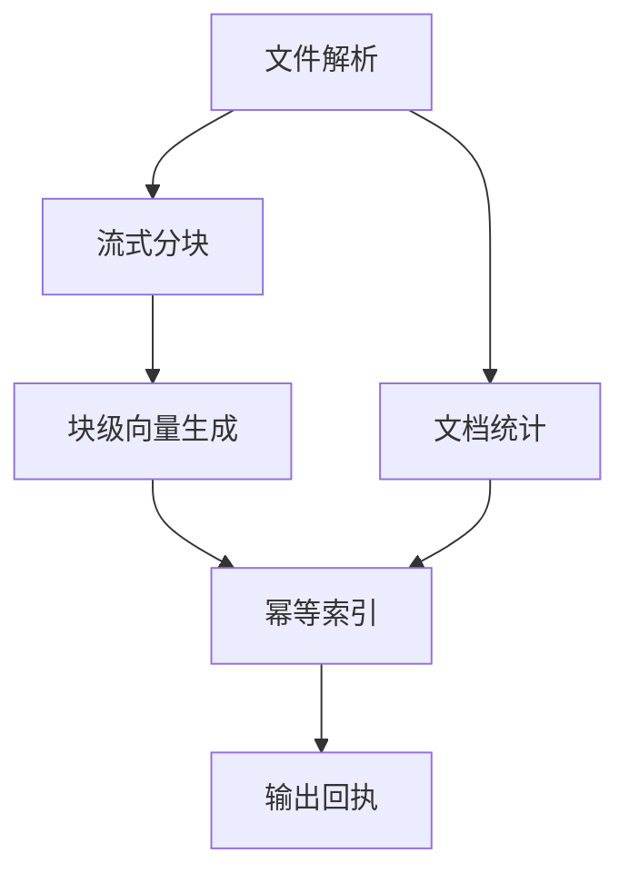

# 文档离线入库业务验收

选择“技术文档入库”为可复现业务：每个UTF-8文本/Markdown文件是一个任务，完整
六步DAG在同一个执行器的独立进程内完成。解析后分块与统计并行，块内部使用
有界线程并行调用HTTP向量服务，结果写入版本化索引，最后生成回执。



算子安装在 `dataflowcore.examples.ingestion`。框架验证文件调度与恢复，不评测
OCR/向量模型的精度；测试HTTP服务返回确定性32维向量。生产可替换parse/embed/index
算子，复用DAG、进度、取消和故障机制。当前参考HTTP协议是`POST {text} -> {vector}`。

## 运行完整业务

先按README启动管控和执行器，所有进程在同一绝对路径访问输入和索引。
主机开发环境、已安装3.14t包时：

```bash
mkdir -p data/documents
printf 'DataFlow 文档入库示例。\n' > data/documents/example.md
python -m dataflowcore.examples.embedding_fixture --port 8081
```

另一个终端设置管理员令牌后执行：

```bash
python examples/ingest_directory.py "$PWD/data/documents" \
  --index-path "$PWD/data/index.sqlite" \
  --embedding-url http://127.0.0.1:8081 --embedding-workers 4
```

embedding_url必须从执行器网络可达。Compose/K8S中的localhost指当前容器，
应改为服务DNS。脚本按文件SHA256及规范化定义生成幂等键，重复运行复用相同任务。
不提供embedding_url时，在文件任务内使用同一确定性向量函数。
更换真实模型时设置`--embedding-profile <model-revision>`，保持输出版本身份准确。

每次Attempt保存document.txt、chunks.jsonl、vectors.jsonl、receipt.json。
步骤返回小型文件引用，块数据流式读写，不把整个文档或所有向量塞入API结果。
大文件分块按固定字符窗与重叠处理；边界测试包含1、128、129、240和32769字符。

## 入库与恢复契约

索引唯一键是(document_id, version, ordinal)。version包含输入SHA256、分块大小、
重叠、embedding_profile和测试CPU参数。同一输入/配置的重跑保留同一版本，
改变分块或模型身份创建新版本。冲突记录内容不一致会永久失败，不会默默覆盖。
默认document_id为输入绝对路径；上层有业务文件ID时应显式提供稳定ID。

SQLite索引是本机/临时kind集群的验收后端，不用于生产NFS上的并发数据库。
生产向量库/关系库应实现同一稳定键、版本隔离、事务/幂等写入和正式结果选择。
这是至少一次执行：外部写入提交后取消或丢失租约，并不撤销已提交的业务副作用；
消费者用成功任务的receipt/manifest选择正式版本。没有跨外部数据库与管控数据库
的分布式事务，也不承诺任意业务副作用只发生一次。

## 功能验收矩阵

| 场景 | 验收证据 |
|---|---|
| 完整六步DAG | 重建原文、逐块比较向量、检查4个文件的SHA256 |
| 分支与汇合 | 分块/统计均依赖parse，index等待embed与stats |
| 页/块线程并行 | context.map保持顺序，阻塞首个结果时生产者预取有界 |
| 大量进度 | 10000次report合并写入，步骤终态立即落盘；1000步进度仍在续租预算内 |
| 重复提交/重复业务运行 | 同一幂等键复用Task；新Task写相同业务版本不增加索引行 |
| 入库后执行器挂掉 | 已提交索引后杀执行器，LOST→新Attempt成功，索引行无重复 |
| 模型服务异常 | 真实HTTP 503整文件重试；400永久失败 |
| 业务失败/手动重试 | 空文件永久失败，手动retry创建新任务并保留旧记录 |
| 取消/超时 | HTTP向量阶段取消不入库；超时最多2次尝试后失败，槽位可复用 |
| 管控短时/长时失联 | 有效租约内继续；超过租约整文件重试；SDK等待容忍暂时不可用 |
| 续租网络阻塞 | 网络线程仍阻塞时，独立看门狗已终止过期进程 |
| 排空/替换 | 排空会话心跳不能撤销状态；已分配任务完成，新任务由替换会话运行 |
| 混合队列 | 1001个池/版本/CPU/内存不匹配的任务不会阻塞后面的可执行文件 |
| 多任务查询 | 107任务分页无遗漏/重复，批量状态给出missing，120文件压力一次完成 |
| 原有可靠性 | 并发唯一领取、旧令牌隔离、完成重放、父进程死亡、强停、噪声日志 |
| 真实K8S业务故障 | 3节点kind、外置HTTP向量服务、Pod删除、管控重启、取消、排空与替换 |

运行 `pytest -q` 验证开发SQLite路径。设置专用DATAFLOW_TEST_DATABASE_URL后，同一套
Store/业务/进程测试也验证PostgreSQL；CI自动完成并上传业务性能及K8S故障记录。
`bash e2e/run.sh`会创建专用本地kind集群，生产部署参考deployment.md。

本轮保留一个文件一个执行器、不做断点续跑的边界。未接入实际OCR/Embedding生产
服务、真实向量库、节点断电或真实RWX存储压测；这些不能从测试模型的吞吐推算。
